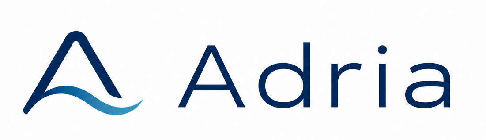

Graphics engine written in C++ with DirectX12 and Metal backends.

## Backends
* **DirectX12** (Windows) 
* **Metal** (macOS) 

## Features
* Render graph
    - Automatic resource barriers
    - Resource reuse using resource pool
    - Automatic resource bind flags and initial state deduction
    - Async Compute
* Ultimate Bindless resource binding
* DDGI
* GPU-Driven Rendering : GPU frustum culling + 2 phase GPU occlusion culling
* Reference path tracer
* Upscalers : FSR2, FSR3, XeSS2, DLSS3.5, MetalFX
* Volumetric lighting: Raymarching, Fog volumes
* Tiled/Clustered deferred rendering 
* ReSTIR DI (wip)
* Shadows
    - PCF shadow maps for directional, spot and point lights
	- Cascade shadow maps for directional lights
    - Ray traced shadows (DXR)
* Volumetric clouds, Hosek-Wilkie sky, Rain
* FFT Ocean
* Automatic exposure
* Bloom
* Ambient occlusion: SSAO, HBAO, RTAO (DXR)
* Reflections: SSR, RTR (DXR)
* Antialiasing: FXAA, TAA
* FFX: Variable Rate Shading, Contrast Adaptive Sharpening, Depth of Field 
* Entity picking with selection silhouettes and transform gizmos
* Film effects: Lens distortion, Chromatic aberration, Vignette, Film grain, CRT filter
* Lens flare: texture-based and procedural
* Profiler: custom and tracy profiler
* Debug tools
    - Debug renderer
    - Shader hot reloading
    - Render graph graphviz visualization
    - GPU printf, GPU assert
    - PIX and RenderDoc programmatic APIs
    - Nsight Aftermath SDK, Nsight Perf SDK
    - Debug Outputs: Diffuse, Normal, Depth, Roughness, Metallic, Emissive, AO, GI, \
      Custom, Shading Extension, View Mipmaps, Triangle Overdraw, Material and Meshlet ID, Motion Vectors

## Screenshots

### DDGI

| Disabled |  Enabled |
|---|---|
|  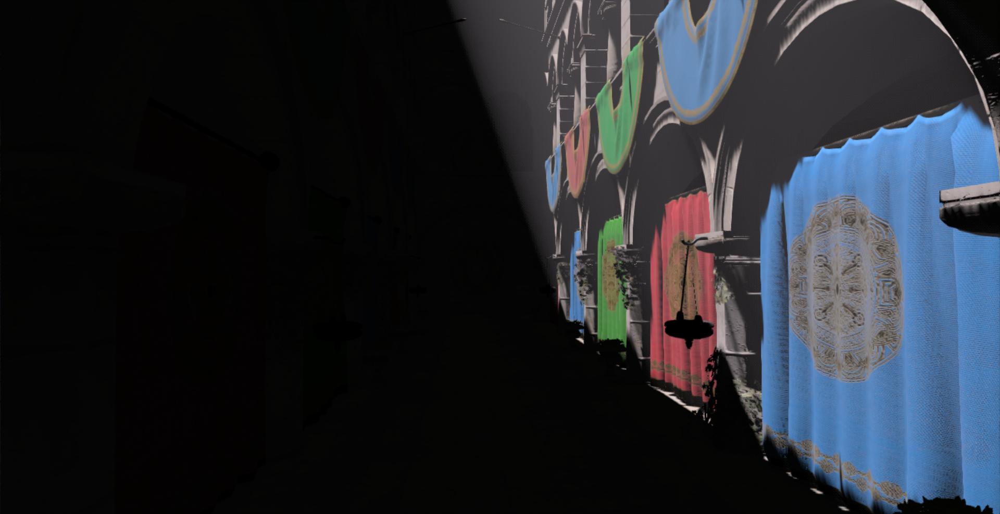 |  |

| Probe Visualization |
|---|
|  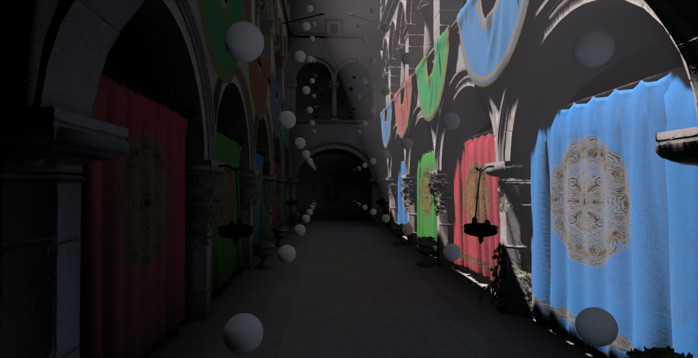 |

### Volumetric Clouds
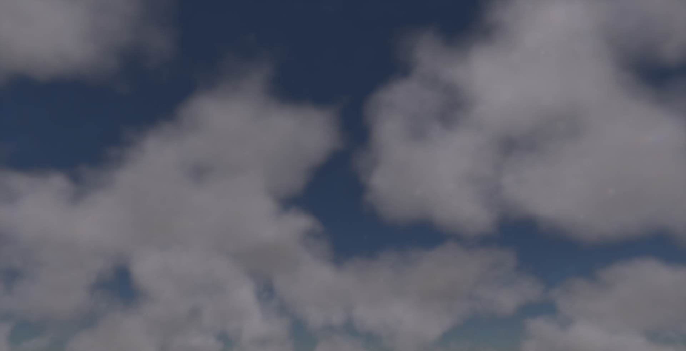 

### San Miguel
 
 

### Bistro
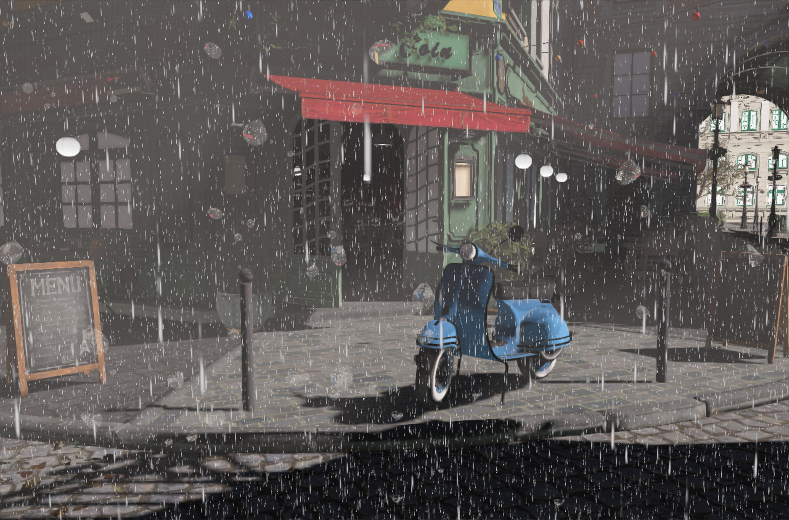 

### New Sponza
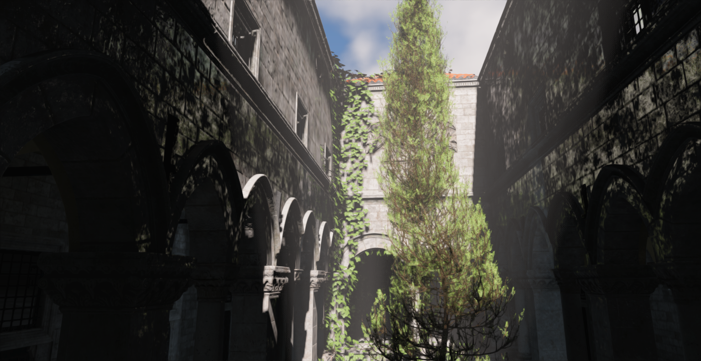 

### Sun Temple
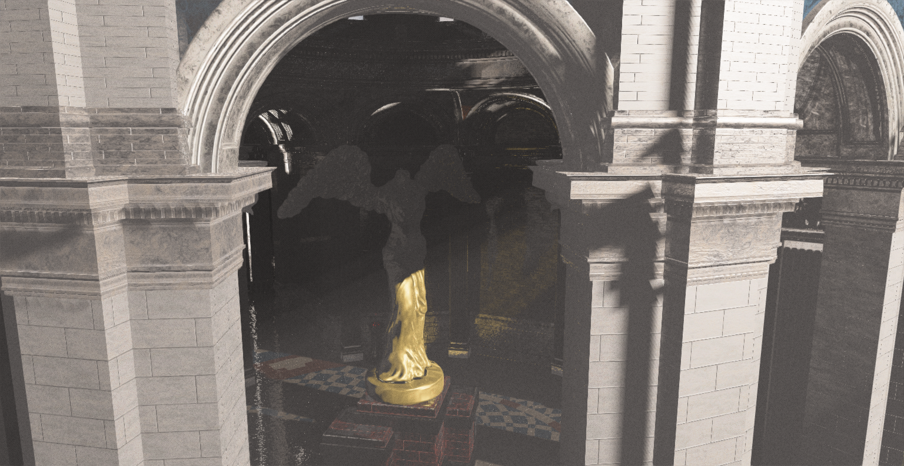 

### Brutalism Hall
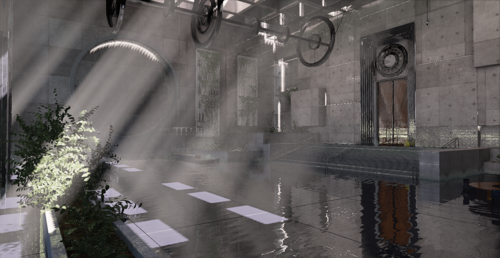 

### Ocean
 

### Path Tracer
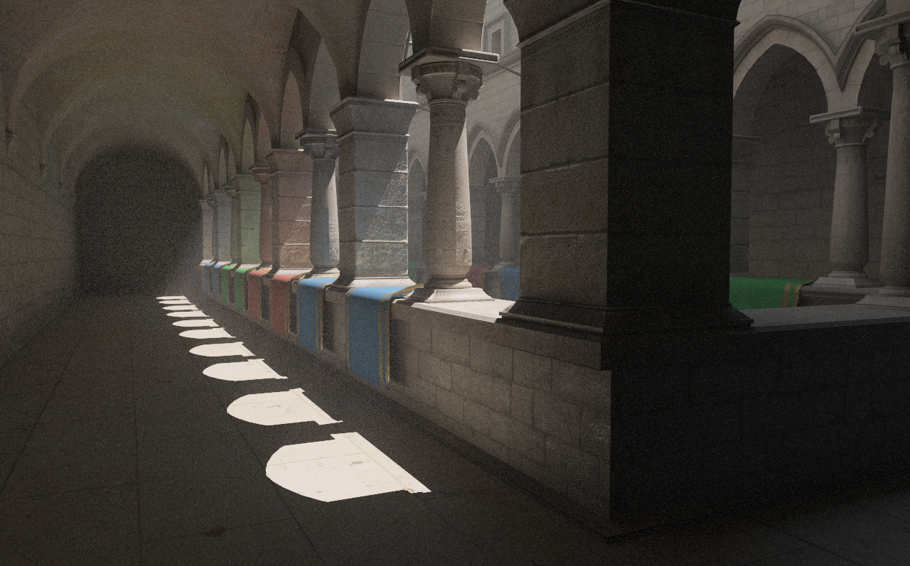 
 

### Ray Tracing Features

| Cascaded Shadow Maps |  Hard Ray Traced Shadows |
|---|---|
|   |  |

| Screen Space Reflections |  Ray Traced Reflections |
|---|---|
|  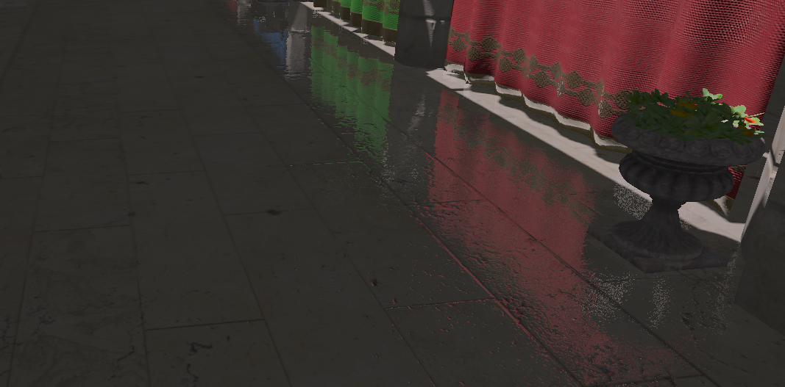 | 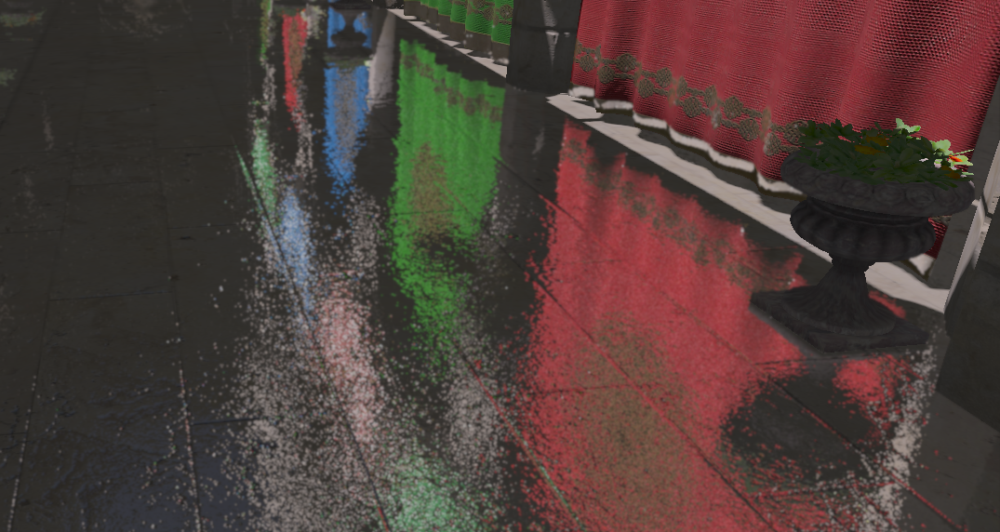 |

| SSAO | RTAO |
|---|---|
|   |  |

### Triangle Overdraw
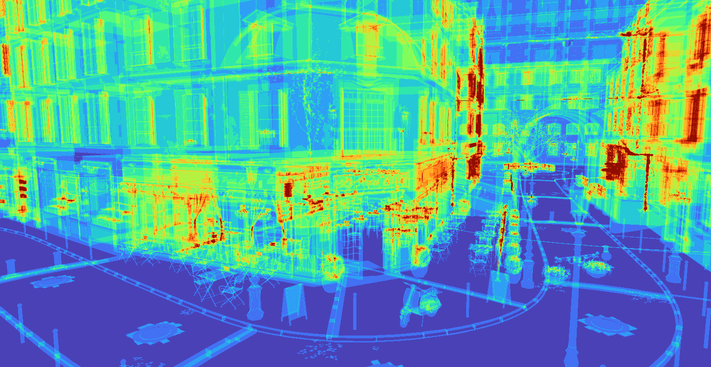 

### Transparent Objects
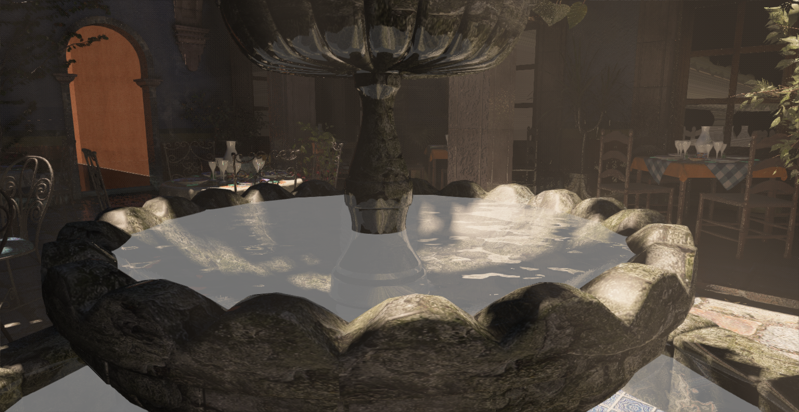 

### Editor
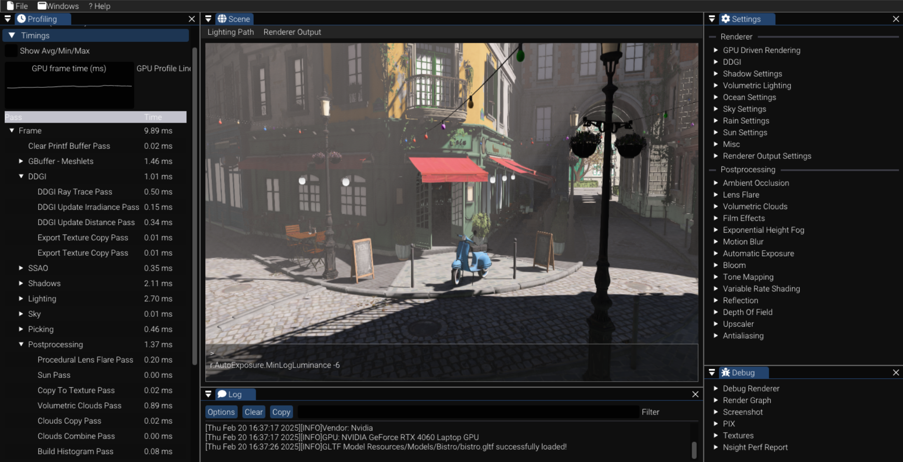 

### Nsight Perf HUD
 

### Render Graph Visualization
 

