Modern cross-platform graphics engine written in C++.

## Rendering Backends

| Backend | Platforms | Status |
|---|---|---|
| Direct3D 12 | Windows | Stable |
| Metal | macOS | Stable |
| Metal 4 | macOS | Planned |
| Vulkan | Windows | Experimental |
| Vulkan (MoltenVK) | macOS | Experimental |
| Vulkan | Linux | Planned |

## Features

* Render graph
    - Automatic barriers and resource state tracking
    - Transient resource pooling and reuse
    - Automatic bind-flag and initial-state deduction
    - Async compute scheduling

* GPU-driven renderer
    - GPU frustum culling and two-phase GPU occlusion culling

* Global illumination and ray tracing
    - DDGI, ReSTIR DI, ReSTIR GI (wip)
    - Ray-traced shadows, reflections, and ambient occlusion 
    - Reference path tracer

* Deferred rendering pipeline
    - Tiled and clustered lighting
    - PCF shadow maps for directional, spot, and point lights
    - Cascaded shadow maps for directional lights
    - SSR, SSAO, HBAO
    - Volumetric raymarching and fog volumes

* Atmosphere and environment rendering
    - Volumetric clouds
    - Hosek-Wilkie sky
    - FFT ocean
    - Rain

* Upscaling and image reconstruction
    - DLSS 3.5, XeSS2, FSR2, FSR3, MetalFX

* Post-processing and image effects
    - TAA, FXAA, bloom, automatic exposure
    - Variable rate shading, CAS, depth of field
    - Film grain, vignette, chromatic aberration, lens distortion, CRT filter
    - Texture-based and procedural lens flare

* Editor and visualization tools
    - Entity picking with selection silhouettes and transform gizmos
    - Debug renderer
    - Debug outputs: diffuse, normal, depth, roughness, metallic, emissive, AO, GI, custom, shading extension, mipmap view, triangle overdraw, material ID, meshlet ID, motion vectors

* Tooling and debugging
    - Shader hot reload
    - GPU printf and GPU assert
    - Render graph Graphviz visualization
    - PIX and RenderDoc programmatic APIs
    - Nsight Aftermath SDK, Nsight Perf SDK
    - Custom profiler and Tracy integration

## Screenshots

### DDGI

| Disabled |  Enabled |
|---|---|
|  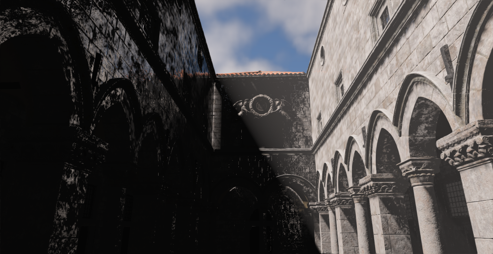 | 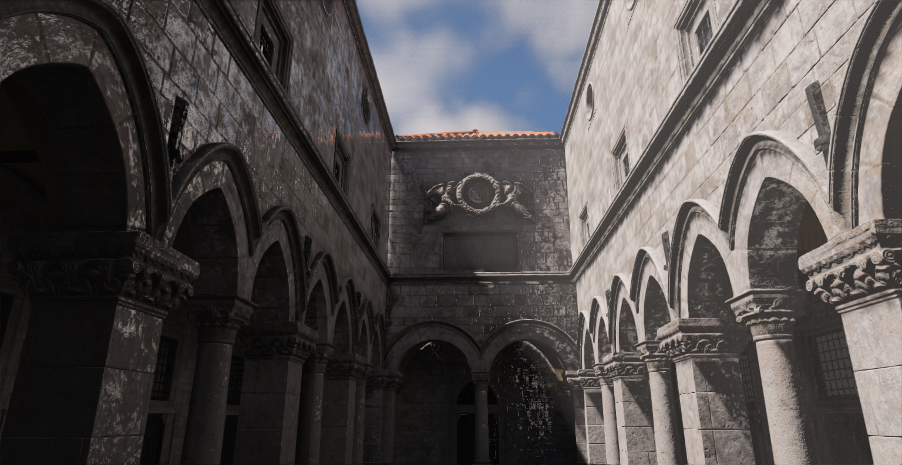 |

| Probe Visualization |
|---|
|  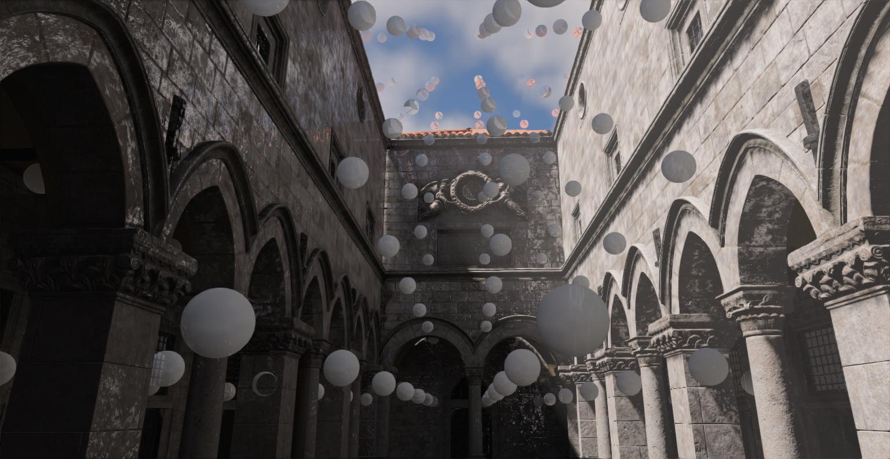 |

### Volumetric Clouds
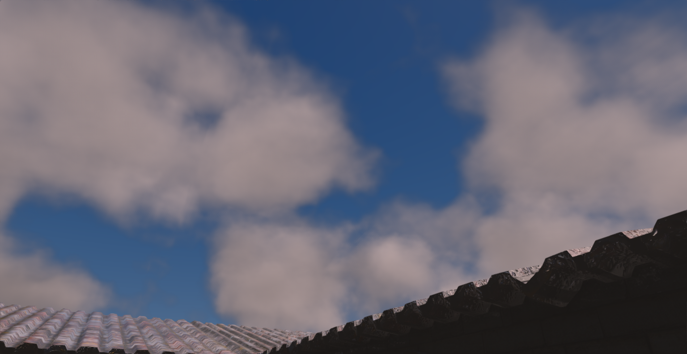 

### San Miguel
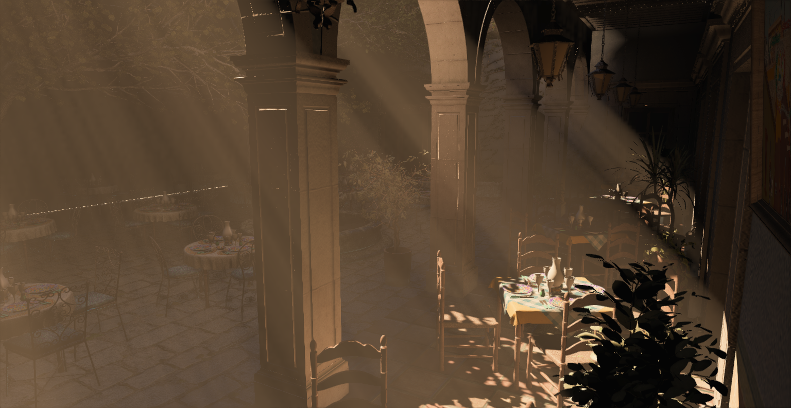 
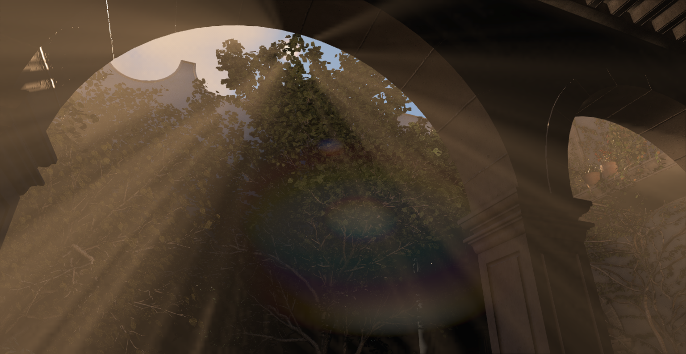 

### Bistro
 

### New Sponza
 

### Sun Temple
 

### Ocean
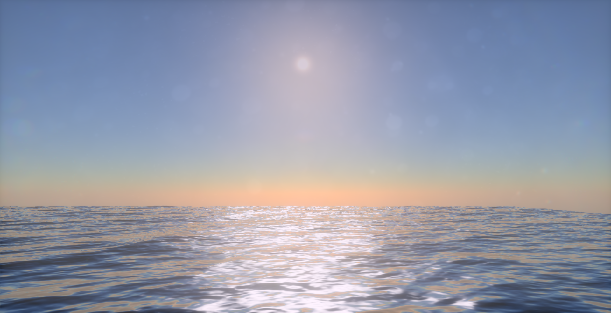 

### Path Tracer
 
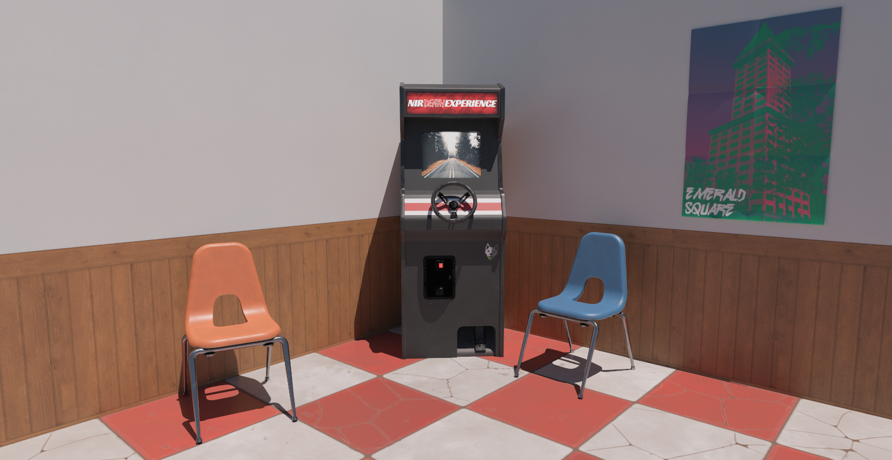 

### Ray Tracing Features

| Cascaded Shadow Maps |  Hard Ray Traced Shadows |
|---|---|
|  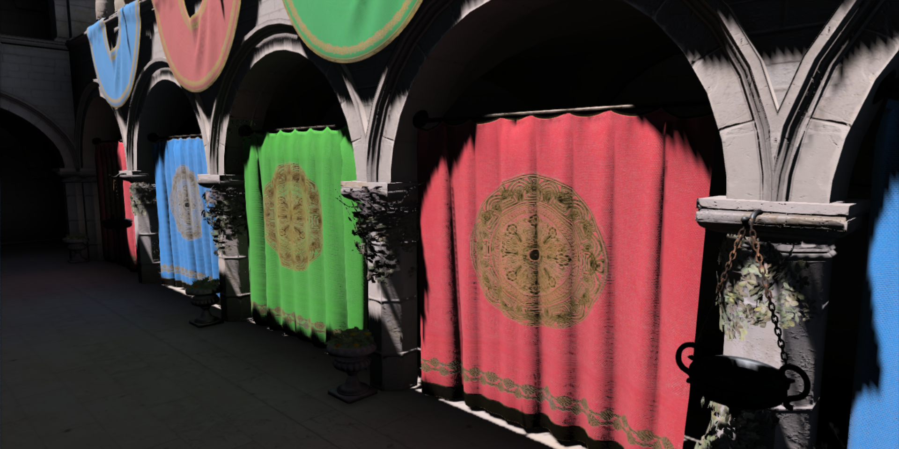 | 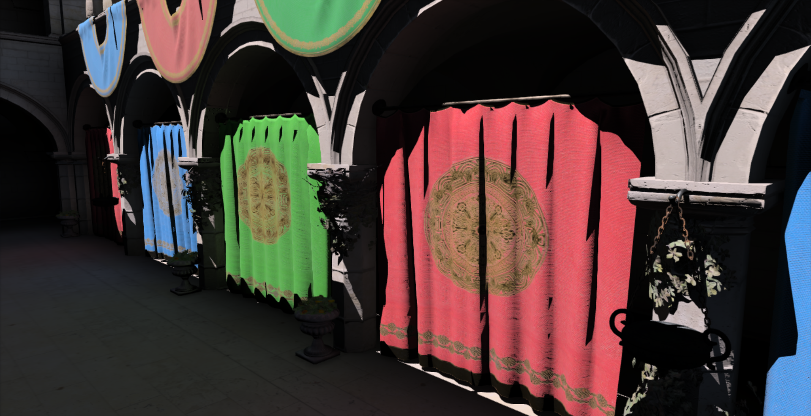 |

| Screen Space Reflections |  Ray Traced Reflections |
|---|---|
|  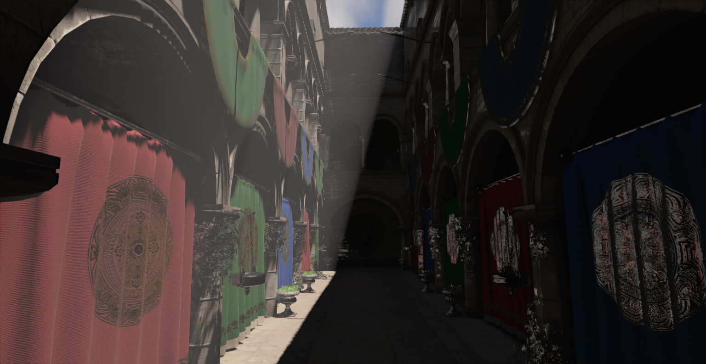 | 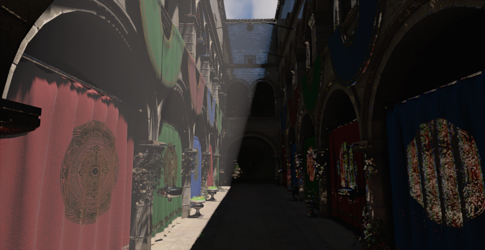 |

| SSAO | RTAO |
|---|---|
|  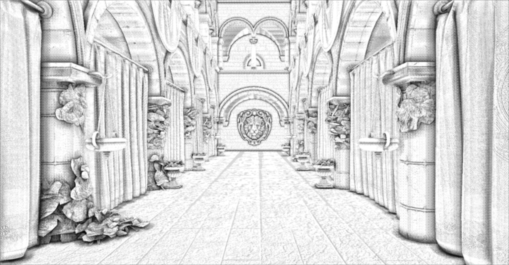 | 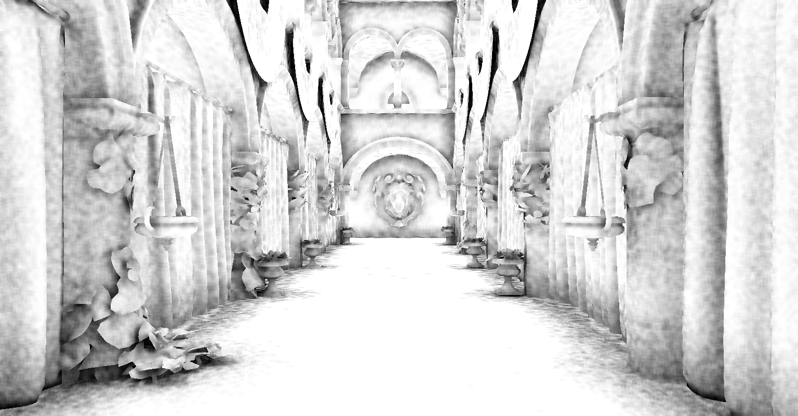 |

### Triangle Overdraw
 

### Editor
 

### Nsight Perf HUD
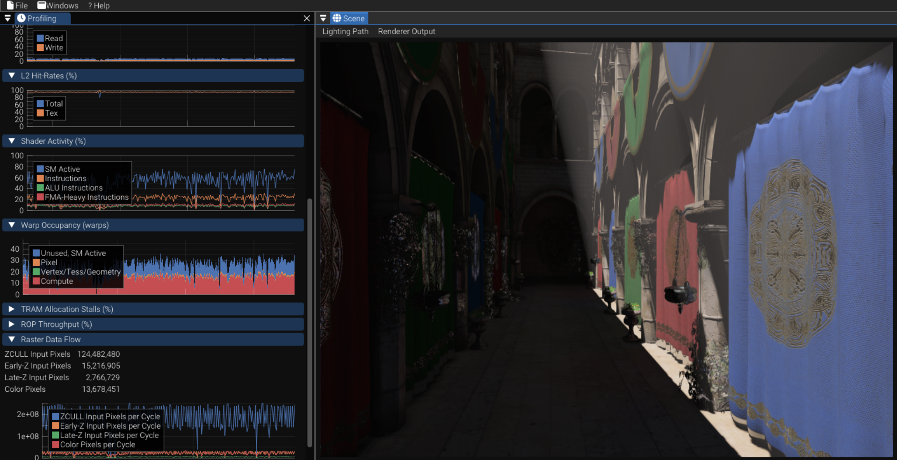 

### Render Graph Visualization
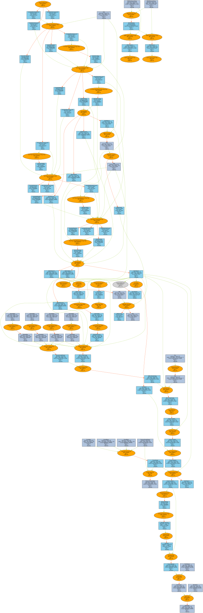 

